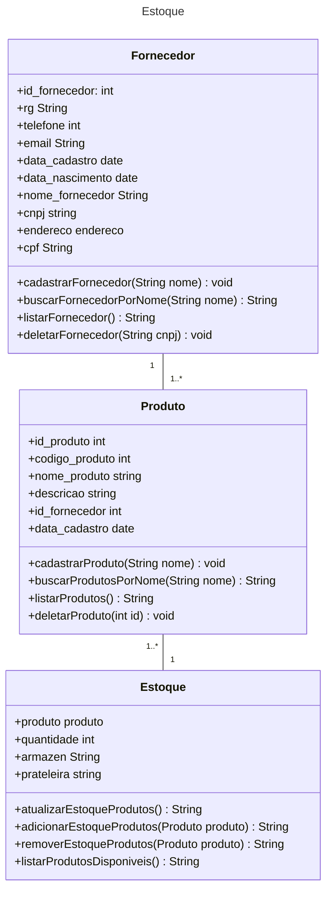

# Projeto POO - Estoque 

O sistema de gestão de estoque é um software que gerencia o controle de estoque de uma
empresa. O sistema é composto por três entidades principais: Produto, Fornecedor e
Estoque. O sistema permite que os usuários possam gerenciar a entrada e saída de
produtos, controlar o estoque de cada produto, além de realizar outras funções de gestão
de estoque.

